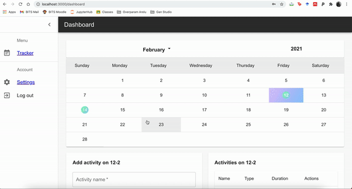
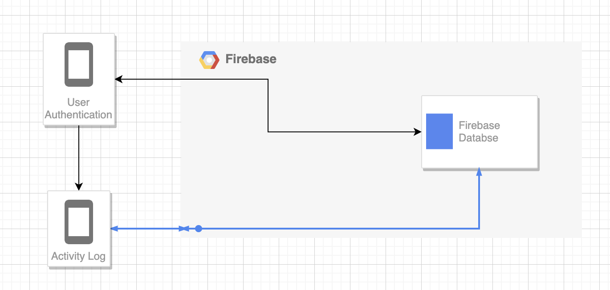

# Sakhi: "Health and fitness 360" App for Women
Repository for "Health and fitness 360" app in partial fulfilment Engage 2021 by Microsoft

**Link:** [https://master.d35deudwj7fg7r.amplifyapp.com/](https://master.d35deudwj7fg7r.amplifyapp.com/)

## Demo:

## Purpose :

1. To create one stop health and fitness application for women through most stages of life
2. Make them aware about risks to some common issues like PCOD, Breast/Cervical Cancer, Anaemia, etc. based on their age, diet consumption, menstrual cycle and exercise patterns, as well as, remind them about visiting a doctor if the risk for these diseases is high.

## Using this App :

1. To run the Sakhi App in your local browser:
2. Clone this repository
3. Open terminal and go this project's directory
4. Run `npm install`
5. Run `npm run start`

## Objectives :

1. Implement basic fitness tracker and health log
2. Adding calender view to visualize daily progress
3. In order to make it Women-centric:
    1. Log menstrual cycles for monitoring your health and  becominng aware about possible risk of PCOD
    2. Become aware about various aspencts related to Womens' health, fitness and nutrition via relevant blog articles
    3. Ability to book appointments to nearby Gynaecs/Obstrecian via Practo API

## Resources Used :

  Techniques and Softwares Used :

  1. React JS - It is an open-source JavaScript library used for building user interfaces. We have used React along with HTML and JSX to create our single page web application. 
  2. Material UI - It's a React-based library that provides rich-looking UI ccomponents
  3. Firbase - It's a database service provided by Google. We use this for storing activity log of the user.
  4. Amazon Amplify - Website has been deployed on this
	
  
## Features added to the basic project :
 
   We have added the ability to log some of the common activities, like Yoga, cycling, running, jogging, daily walk, etc. We have also added the ability to log menstrual cycles. Apart from that, the user can also view articles that will be informative about Women health, fitness, technology, nutrition, etc. The user can also book appointment to nearby Gynaecs/Obstrecian via Practo.

## Future Work :

  1. Currently practo API is under maintenance, so need to integrate that once it's live.
  2. Add dynamicc update to blogs, with AI-based reccomendation based on the user's age and parameters such as does the user have regular menstrual cycle, how frequently does the user exercise, etc.
  3. Currently, the project does not perform analytics on the logged activites. It is very important for a user to see Charts/Plots to analyse their activites.
  4. Need to add a calorie-ccounter which gives an estimate of energy-level based on exercises as well as the ability to log daily consumption diet.
  5. Based on menstrual cycles - see for irregularities and report if checkup is necessary
  6. We should fetch user's health/activity logs from her smartphone (with due permission) using Apple's HealthKit or Google Fit API
  7. Add medicine reminder (we already have the calendar; so we need to add the ability to log what medicines are needed to be consumed on what day and in what doses)
  8. Send push-notifications to remind user about maintaing exercise streak, about possible upcoming menstrual cycle (based on previous estimated cycle length), as well as, for medicines.

## Bugs / Point-of-Failure:
 1. Deleting all the activvites leads to deletion of activity key from the firebase and throws out error. 
 2. Practo API currently unavailable.
 3. Clicking a blog link / being redirected from the website, and then going back to the website using 'history.back' or simply using the same URL does not remeber the logged in user. Hence the user has to sign-in again. 

## Workflow

